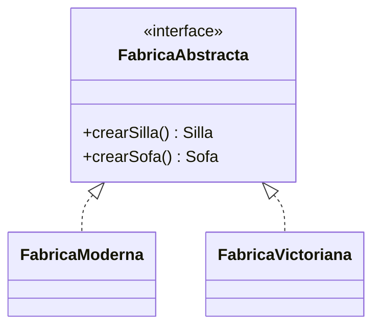

# Patrón Abstract Factory

## Definición

Interfaz para crear **familias de objetos relacionados o dependientes** sin especificar sus
clases concretas ([[fuente-s07-factory-builder]], diapositiva 17).

## Problema que resuelve

Cuando los productos deben combinarse de forma coherente: no tiene sentido una silla moderna
con un sofá victoriano. La fábrica garantiza que toda la familia sea del mismo estilo.

## Estructura

Participantes según el curso: Abstract Factory, Concrete Factory, Abstract Product,
Concrete Product y Client (diapositiva 17).

## Ejemplo del curso

Familias de muebles: `Silla` y `Sofa`, con `MueblesModernosFactory` y
`MueblesVictorianosFactory`. El cliente recibe la fábrica por constructor y nunca conoce las
clases concretas ([[fuente-s07-factory-builder]], diapositivas 19–21).

## Aplicación en Podología Loayza

**No se usa** *(propuesta del agente)*.

No hay familias de productos que deban ser coherentes entre sí. Los objetos que el sistema
crea —exportadores, verificaciones, reconocedores— son **independientes**: nada se rompe si
se combina un exportador de Excel con un reconocedor distinto. Introducir familias donde no
las hay añadiría una capa de clases sin ganancia.

El propio curso avisa de esto (diapositiva 18): se empieza por Factory Method, *más
adaptable*, y sólo se progresa hacia Abstract Factory *cuando el diseñador se da cuenta de
que se requiere más flexibilidad*. Aquí no se ha llegado a ese punto, y forzarlo sería
sobre-ingeniería.

**Si algún día aplicara:** si cada sede necesitara una familia completa y coherente de
componentes —su reconocedor, su exportador y sus reglas, todos combinables sólo entre
sí—, este sería el patrón. Hoy no es el caso.

## Patrones relacionados

[[patron-factory]] (el punto de partida), [[patron-prototype]] (el curso señala que una
fábrica abstracta puede implementarse clonando), [[patron-builder]].

## Errores comunes

Usarlo por adelantado «por si acaso»: multiplica clases e interfaces sin que exista aún la
variabilidad que justifica el coste.

## Fuentes

[[fuente-s07-factory-builder]] (diapositivas 17–21)
