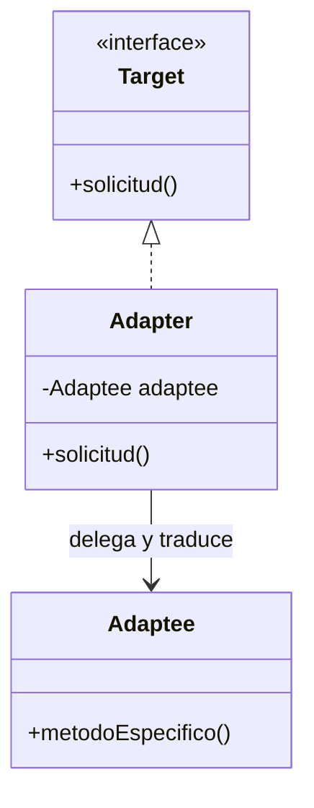

# Patrón Adapter

## Definición

Resuelve problemas de **desajuste** entre interfaces: hace que una clase existente encaje
donde el cliente espera otra ([[fuente-s08-adapter-facade]], diapositiva 10). El desajuste
va desde parámetros que no coinciden hasta protocolos entre sistemas distintos.

## Problema que resuelve

El sistema nuevo necesita algo que ya existe, pero con otra forma. Modificar lo existente no
es opción —es de un tercero, o está en producción—, así que se envuelve.

## Estructura



Participantes (diapositiva 11): **Target** es la abstracción que el cliente usa; **Adapter**
la implementa y **Adaptee** es lo que se adapta.

## Ejemplo del curso

```java
class InventoryAdapter implements InventoryService {
    private OldInventorySystem oldInventorySystem;

    @Override
    public String getInventoryItem(String itemId) {
        String oldDetails = oldInventorySystem.getItemDetails(itemId);
        String[] details = oldDetails.split(", ");     // traduce el formato
        return "ID: " + details[0].split(": ")[1] + ", Stock: " + details[1].split(": ")[1];
    }
}
```

([[fuente-s08-adapter-facade]], diapositivas 13–14)

## Aplicación en Podología Loayza

**Candidato fuerte** *(propuesta del agente)*. Tres usos, todos reales:

**1. El motor de reconocimiento facial.** Es la pieza más incierta del proyecto: hoy no está
decidido cuál se usará, y es probable que se cambie. Definiendo una interfaz propia
—`ReconocedorFacial`, con lo que el dominio necesita: comparar una foto contra el padrón y
devolver candidatas con su confianza— cada motor concreto entra como adaptador. Cambiar de
proveedor toca **una clase**.

Esto también protege el requisito de privacidad de `CLAUDE.md` §8: el adaptador es el único
punto que ve la imagen cruda y puede convertirla en plantilla biométrica antes de que
circule.

**2. La librería de Excel.** Apache POI tiene su propia forma de trabajar; el dominio no
debería conocerla. Un adaptador traduce entre `CronogramaSemanal` y la rejilla concreta de
[[formato-cronograma-actual]].

**3. Pruebas.** Un adaptador falso que devuelve resultados fijos permite probar toda la
tubería sin motor real ni fotos reales. Sin esta abstracción, el sistema es prácticamente
imposible de probar.

## Patrones relacionados

[[patron-facade]] (simplifica un subsistema; el Adapter traduce una interfaz),
[[patron-decorator]] (misma estructura, otra intención: añade comportamiento en vez de
traducir), [[patron-proxy]], [[patron-bridge]].

## Errores comunes

Meter lógica de negocio en el adaptador: su trabajo es traducir, nada más. Adaptar hacia una
interfaz que copia la del adaptee, con lo que el desajuste no se resuelve, se propaga.

## Fuentes

[[fuente-s08-adapter-facade]] (diapositivas 10–16)
