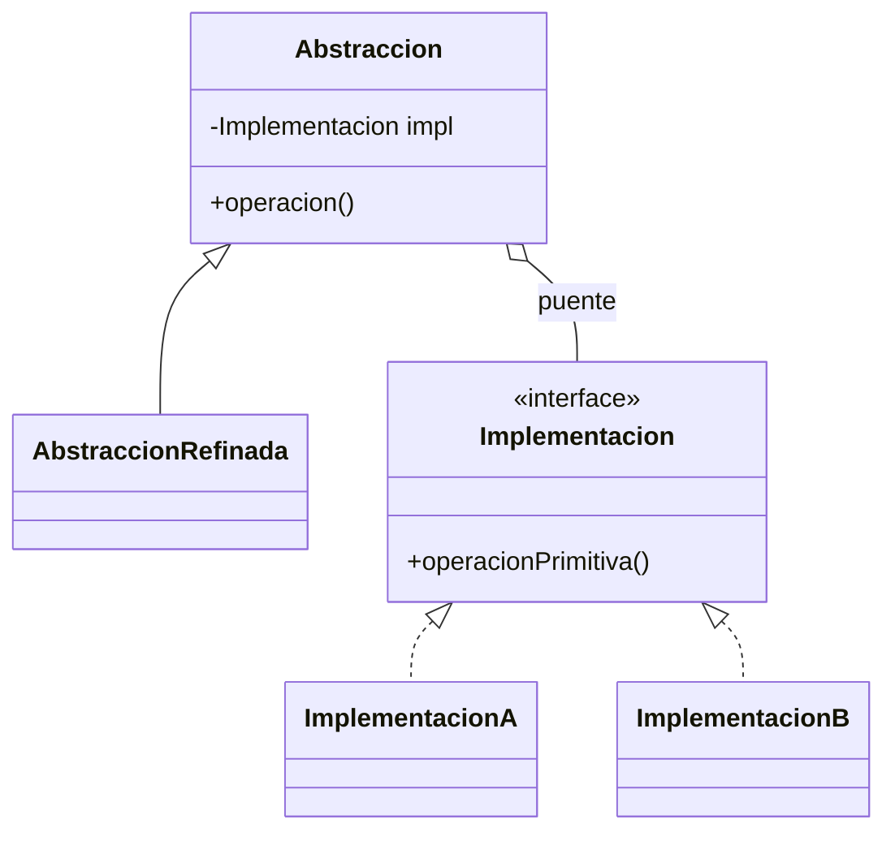

# Patrón Bridge

## Definición

**Separa la abstracción de su implementación** para que ambas varíen de forma
independiente, mediante una interfaz abstracta para las implementaciones concretas
([[fuente-s11-proxy-bridge]], diapositiva 18).

## Problema que resuelve

La **explosión de clases**: cuando hay N abstracciones y M implementaciones, la herencia
exige N×M clases. El Bridge las reduce a N+M (diapositiva 19).

## Estructura

## Ejemplo del curso

> [!warning] Sin código en la fuente
> S11 sólo trae definición, importancia y una tabla de ventajas y desventajas. El ejemplo
> está en `S11-Ejemplo-MVC-Proxy-Bridge.docx`, sin ingerir.

## Aplicación en Podología Loayza

**No se usa por ahora** *(propuesta del agente)*.

El caso donde encajaría son las **notificaciones**: avisar a una trabajadora de que su
marcación quedó en revisión, o a la administradora de que hay casos pendientes. Ahí hay dos
ejes que podrían variar por separado —el **tipo** de aviso y el **canal** (push de la PWA,
correo, WhatsApp)—, y sin Bridge aparecerían clases como
`AvisoDeRevisionPorCorreo`, `AvisoDeRevisionPorPush`, `ResumenDiarioPorCorreo`…

Pero **esa explosión todavía no existe**: hoy no hay ningún tipo de notificación decidido.
Introducir el puente ahora sería resolver un problema que no se tiene, y el curso advierte
que el Bridge *puede incrementar la complejidad inicial del diseño* y *requiere más esfuerzo
para establecer correctamente las jerarquías* (diapositiva 20).

**Criterio para reconsiderarlo:** en cuanto haya **dos** tipos de aviso y **dos** canales,
este patrón deja de ser sobre-ingeniería y pasa a ser la respuesta correcta. Queda anotado
para revisarlo entonces.

## Patrones relacionados

[[patron-adapter]] (adapta lo que ya existe; el Bridge se diseña desde el principio),
[[patron-strategy]] si el curso lo cubre más adelante, [[patron-abstract-factory]].

## Errores comunes

Aplicarlo antes de que exista la variabilidad que lo justifica; confundirlo con Adapter.

## Fuentes

[[fuente-s11-proxy-bridge]] (diapositivas 18–21)
