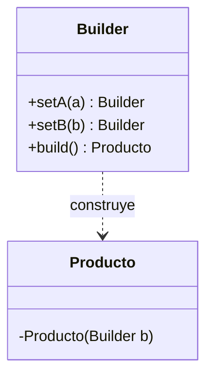

# Patrón Builder

## Definición

Construye un objeto complejo **paso a paso**, evitando los **constructores telescópicos**
—constructores con demasiados parámetros— ([[fuente-s07-factory-builder]], diapositiva 22).

## Problema que resuelve

Un objeto con muchos atributos, varios opcionales. Sin Builder acaban apareciendo cinco
constructores distintos, o uno con ocho parámetros donde nadie recuerda el orden y dos
`boolean` seguidos significan cosas opuestas.

## Estructura



## Ejemplo del curso

```java
public class Coche {
    private String marca; private String modelo; private int año;
    private String color; private boolean tieneAireAcondicionado; private boolean tieneGPS;

    private Coche(CocheBuilder builder) {         // constructor privado
        this.marca = builder.marca;
        // ...
    }

    public static class CocheBuilder {
        private String marca;
        public CocheBuilder setMarca(String marca) { this.marca = marca; return this; }
        // ... setters encadenados
    }
}
```

([[fuente-s07-factory-builder]], diapositivas 22–23)

## Aplicación en Podología Loayza

**Candidato fuerte, y probablemente el mejor encaje creacional del proyecto**
*(propuesta del agente)*.

`Marcacion` es exactamente el objeto que el patrón describe. Reúne:

- foto y su referencia de almacenamiento;
- **hora del servidor** (obligatoria y autoritativa) y hora declarada por el dispositivo
  (opcional, sólo informativa);
- coordenadas, precisión del GPS;
- sede y trabajadora identificada;
- comentario de texto, opcional;
- identificador del dispositivo y token de captura;
- resultado de **cada** verificación antifraude — una lista que crece;
- veredicto, nivel de confianza y estado.

Un constructor con todo eso es ilegible, y muchos campos sólo se conocen **después** de
pasar por etapas distintas de la tubería. El Builder deja que cada etapa aporte lo suyo y
que el objeto se selle al final.

Encaja además con el principio de que **nunca se inventa un dato** (`CLAUDE.md` §8): el
`build()` es el sitio natural para exigir que los campos obligatorios estén presentes y
fallar ruidosamente si falta alguno, en vez de rellenar con valores por defecto silenciosos.

Segundo candidato: `CronogramaSemanal`, que se arma sede por sede, día por día, y termina
con los conteos calculados ([[formato-cronograma-actual]]).

## Patrones relacionados

[[patron-factory]] (elegir el tipo vs. armar el objeto), [[patron-prototype]] (copiar en
lugar de construir), [[patron-composite]].

## Errores comunes

Usarlo para objetos de dos campos; permitir que `build()` devuelva un objeto a medio
construir sin validar.

## Fuentes

[[fuente-s07-factory-builder]] (diapositivas 22–23)
