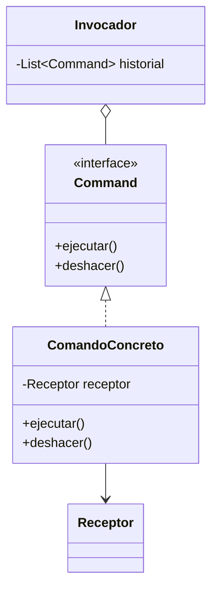

# Patrón Command

## Definición

**Encapsula una solicitud como un objeto**, desacoplando al emisor del receptor de la
acción. Habilita operaciones reversibles, **colas de comandos**, registro de operaciones y
transacciones diferidas ([[fuente-s13-command-memento]], diapositivas 8 y 12).

> [!warning] Error en la fuente
> La diapositiva 10 de S13, titulada «Patrón Command», describe en realidad el
> [[patron-memento]]. Esta definición se toma de las diapositivas 8, 11 y 12.

## Problema que resuelve

Quien pide una acción y quien la ejecuta quedan atados. Y como la acción no es un objeto, no
se puede guardar, encolar, registrar ni deshacer.

## Estructura

## Ventajas y desventajas según el curso

A favor (diapositiva 12): desacopla invocador de ejecutor, facilita deshacer y rehacer,
permite encolar y registrar comandos, y añadir funcionalidad sin tocar el código existente.

En contra: proliferan las clases, cada comando es un objeto que ocupa memoria, y una cola
demasiado grande introduce latencia.

## Aplicación en Podología Loayza

**Candidato fuerte, y resuelve un requisito real del negocio, no un capricho de diseño**
*(propuesta del agente)*.

La administradora interviene sobre la cola de revisión: aprobar una marcación dudosa,
rechazarla, corregir una hora, reasignar la trabajadora identificada, registrar a mano la
marcación de alguien que se quedó sin batería ([[antifraude]], pregunta abierta 4).

Cada una de esas acciones **modifica un registro de asistencia**, que es un documento con
consecuencias laborales. Eso obliga a poder responder tres preguntas: **quién lo cambió,
cuándo, y qué había antes**.

Si cada intervención es un objeto `Command` con su `ejecutar()` y su `deshacer()`, las tres
respuestas salen gratis:

- el **historial de comandos es el registro de auditoría** — no hay que construirlo aparte;
- **deshacer** una corrección equivocada es una operación, no una cirugía sobre la base de
  datos;
- las correcciones pueden **encolarse** y aplicarse en lote.

Sin este patrón, la auditoría termina siendo un montón de inserciones sueltas en una tabla
de bitácora, escritas a mano en cada método y olvidadas en el primero que se añada después.

**Sobre la desventaja de la memoria** que señala el curso: aquí no aplica de forma
preocupante. Son unas pocas correcciones al día, no miles de operaciones por segundo.

## Patrones relacionados

[[patron-memento]] (guarda el estado previo que el `deshacer()` necesita — se usan juntos),
[[patron-state]], [[patron-facade]].

## Errores comunes

Comandos que hacen demasiado y ya no se pueden deshacer limpiamente; un historial que crece
sin límite; usarlo para operaciones triviales.

## Fuentes

[[fuente-s13-command-memento]] (diapositivas 8, 11–13)
