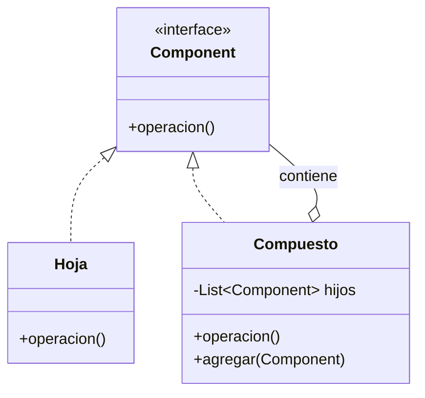

# Patrón Composite

## Definición

Para elementos **jerárquicos** construidos sobre relaciones **parte-todo**. Permite que el
cliente trate de forma **uniforme** a un elemento simple y a una composición de elementos
([[fuente-s09-decorator-composite]], diapositiva 14).

El curso lo define en relación con el Decorator: es **una generalización del Decorator con
una colección agregada de instancias de Component**, mientras que el decorador sólo ofrece
*una composición vertical simple entre el todo y sus partes*.

## Problema que resuelve

El cliente tiene que preguntar «¿esto es uno o son muchos?» antes de cada operación. Con
Composite, hoja y rama responden a la misma interfaz.

## Estructura

## Ejemplo del curso

Sistema de gestión de pacientes: la interfaz `Treatment` con `getDescription()` y `cost()`;
un `SingleTreatment` y un tratamiento compuesto se usan igual, y el compuesto suma los
costes de sus partes ([[fuente-s09-decorator-composite]], diapositivas 16–17).

## Aplicación en Podología Loayza

**Candidato fuerte, y el que mejor resuelve el problema central del proyecto**
*(propuesta del agente)*.

**1. Las verificaciones antifraude.** [[antifraude]] enumera siete verificaciones y dice
explícitamente que deben poder añadirse y quitarse. Con Composite:

- cada verificación individual es una **hoja** que recibe la marcación y devuelve un
  resultado con su confianza;
- una **verificación compuesta** agrupa varias y combina sus resultados en un veredicto;
- el `ServicioDeMarcacion` ([[patron-facade]]) invoca **una sola** verificación, sin saber
  si detrás hay una o veinte.

Eso permite agrupar por naturaleza —verificaciones de ubicación, de identidad, de
temporalidad— y configurar perfiles distintos por sede sin tocar código. Es literalmente el
ejemplo del curso: costes que se suman a través de una jerarquía, aquí puntuaciones de
confianza.

**2. El cronograma.** La rejilla de [[formato-cronograma-actual]] es una jerarquía:
cronograma semanal → día → marcaciones de una trabajadora. Los conteos `MAÑANA` y `TARDE`
son una agregación que sube por el árbol — y recalcularla siempre, en vez de copiarla, es
justo lo que el proceso manual dejó de hacer durante 22 semanas.

## Patrones relacionados

[[patron-decorator]] (su caso particular vertical), [[patron-builder]] (para armar el
árbol), [[patron-facade]].

## Errores comunes

Poner `agregar()` y `quitar()` en la interfaz común, obligando a las hojas a implementar
métodos que no tienen sentido; jerarquías tan profundas que el recorrido se vuelve costoso.

## Fuentes

[[fuente-s09-decorator-composite]] (diapositivas 14–17)
