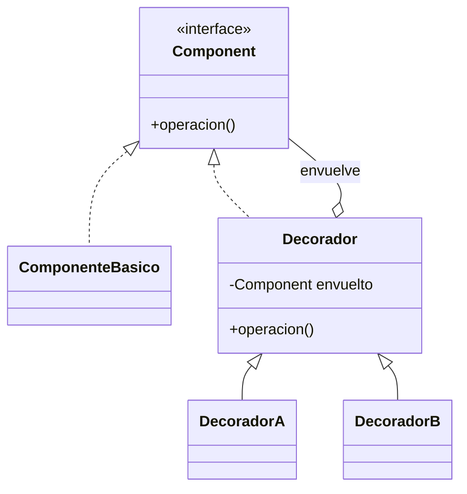

# Patrón Decorator

## Definición

Añade responsabilidades a un objeto **envolviéndolo**. El decorador y el componente básico
derivan del mismo tipo, y el decorador **agrega una instancia** del componente y decora su
operación ([[fuente-s09-decorator-composite]], diapositiva 9).

## Problema que resuelve

Añadir comportamiento sin heredar y sin modificar la clase original, y poder **apilar**
varios añadidos en cualquier combinación. Con herencia harían falta todas las combinaciones
posibles como subclases.

## Estructura



## Ejemplo del curso

```java
public abstract class TransportDecorator implements Transport {
    protected Transport decoratedTransport;
    public TransportDecorator(Transport t) { this.decoratedTransport = t; }
    public double cost() { return decoratedTransport.cost(); }
}

public class InsuranceDecorator extends TransportDecorator {
    public double cost() { return decoratedTransport.cost() + 20.0; }
}
```

Y se apilan: `new TrackingDecorator(new InsuranceDecorator(new BasicTransport()))`
([[fuente-s09-decorator-composite]], diapositivas 11–13).

## Aplicación en Podología Loayza

**Candidato fuerte** *(propuesta del agente)*.

**1. Envolver el reconocedor facial.** El `ReconocedorFacial` de [[patron-adapter]] necesita
varias capas que no son asunto suyo, y que se quieren poder activar por separado:

```
ReconocedorConMetricas( ReconocedorConAuditoria( ReconocedorConCache( ReconocedorReal ) ) )
```

- **caché**: no volver a analizar la misma foto;
- **auditoría**: dejar rastro de cada intento de identificación — obligatorio con datos
  biométricos (`CLAUDE.md` §8);
- **métricas**: medir cuánto tarda y con qué confianza acierta, para poder ajustar umbrales.

Ninguna de esas capas pertenece al motor de reconocimiento. Apilarlas es exactamente el
ejemplo del transporte con seguro y rastreo.

**2. Enriquecer verificaciones antifraude.** Una verificación puede envolverse para que
además registre su resultado o tolere fallos sin tumbar la cadena ([[antifraude]]).

**Cuidado** con lo que el propio curso advierte (diapositiva 9): Decorator y
[[patron-proxy]] se parecen estructuralmente pero difieren en intención. Aquí el interés
está en **lo que se añade** (caché, auditoría) → Decorator. Cuando el interés esté en
**controlar el acceso al objeto envuelto** → Proxy.

## Patrones relacionados

[[patron-composite]] (el curso lo llama una generalización del Decorator con colección),
[[patron-proxy]] (misma estructura, otra intención), [[patron-adapter]].

## Errores comunes

Apilar tantas capas que ya nadie sabe qué se está ejecutando; que un decorador cambie el
contrato en vez de sólo enriquecerlo.

## Fuentes

[[fuente-s09-decorator-composite]] (diapositivas 9–13)
