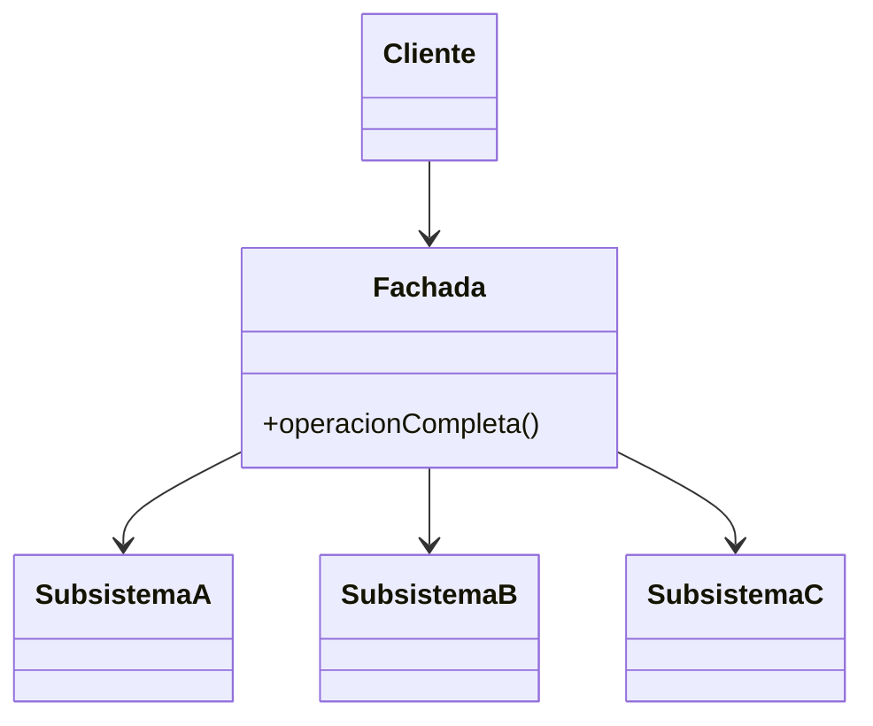

# Patrón Facade

## Definición

Ofrece una interfaz **unificada** sobre un sistema complejo compuesto de varios subsistemas:
**un único punto de entrada** que simplifica el acceso
([[fuente-s08-adapter-facade]], diapositiva 17).

## Problema que resuelve

El cliente tiene que conocer y coordinar media docena de componentes en el orden correcto.
La fachada esconde esa coreografía.

## Estructura

## Ejemplo del curso

`LavadoraFacade` sobre los subsistemas `Lavado`, `Enjuague` y `Centrifugado`: el cliente
llama a la lavadora, no a cada parte ([[fuente-s08-adapter-facade]], diapositivas 19–21).

La otra analogía del curso encaja mejor con este proyecto: el cliente no necesita conocer el
inventario, le pregunta al comerciante, que sabe dónde está cada cosa (diapositiva 18).

## Aplicación en Podología Loayza

**Candidato fuerte, y es el patrón que da forma a la tubería entera**
*(propuesta del agente)*.

La tubería de [[adr-001-stack-y-arquitectura]] tiene seis etapas, cada una con su
componente: validación antifraude, identificación facial, tipificación, registro,
consolidación. El controlador REST que recibe la foto **no debería orquestar eso**.

Un `ServicioDeMarcacion` expone un único método —recibir una marcación y devolver su
resultado— y coordina las etapas por dentro. El controlador queda de tres líneas, y la
lógica de negocio no se filtra a la capa web.

Beneficio secundario y nada menor: **es el punto donde poner la transacción**. Una marcación
se registra entera o no se registra; sin un punto único de entrada eso se vuelve difícil de
garantizar.

Segunda fachada útil: `ServicioDeCronograma`, que esconde el armado de la rejilla semanal,
el recálculo de conteos y la exportación a Excel tras una sola operación.

**Cuidado:** una fachada que crece sin freno se convierte en un objeto-dios, que es un
[[antipatrones|antipatrón]] conocido. Debe coordinar, no decidir: las reglas viven en los
componentes.

## Patrones relacionados

[[patron-adapter]] (traduce una interfaz; la fachada simplifica un conjunto),
[[patron-composite]], [[patron-command]] (las operaciones que la fachada expone pueden
encapsularse como comandos), [[mvc]].

## Errores comunes

Convertirla en un objeto-dios; exponer los subsistemas a través de ella y perder así el
beneficio.

## Fuentes

[[fuente-s08-adapter-facade]] (diapositivas 17–21)
