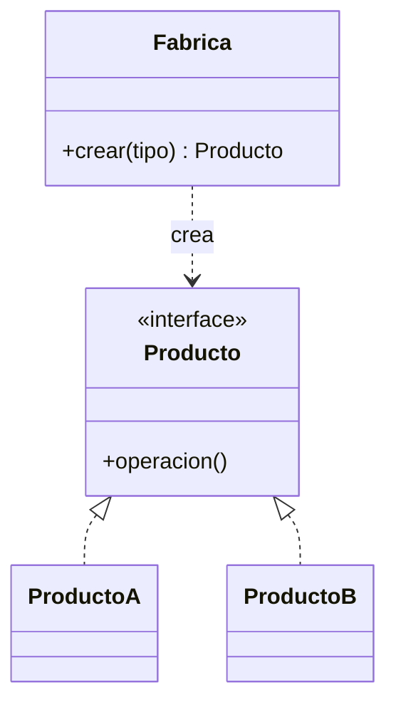

# Patrón Factory Method

## Definición

Genera objetos **sin revelar al cliente el mecanismo de creación**; el cliente pide por una
interfaz estándar y recibe la implementación que corresponda
([[fuente-s07-factory-builder]], diapositiva 10).

## Problema que resuelve

El cliente queda atado a clases concretas: añadir un tipo nuevo obliga a tocar todo el
código existente. El caso del curso: un sitio que sólo vendía libros y luego añade ropa y
calzado (diapositivas 13–14).

## Estructura



## Ejemplo del curso

```java
public class NotificacionFactory {
    public static Notificacion crearNotificacion(String tipo) {
        if (tipo.equalsIgnoreCase("correo")) return new NotificacionCorreo();
        else if (tipo.equalsIgnoreCase("sms")) return new NotificacionSMS();
        else throw new IllegalArgumentException("Tipo de notificación desconocido");
    }
}
```

([[fuente-s07-factory-builder]], diapositiva 15)

## Aplicación en Podología Loayza

**Candidato fuerte** *(propuesta del agente)*. Dos usos claros:

**1. Exportadores del cronograma.** Hoy el formato objetivo es Excel
([[formato-cronograma-actual]]), pero pedirán PDF o CSV. Una `FabricaDeExportadores` que
devuelva el `ExportadorCronograma` adecuado deja el resto del sistema intacto cuando se
añada uno.

**2. Verificaciones antifraude.** Cada sede puede activar un subconjunto distinto de las
verificaciones de [[antifraude]]. Una fábrica que las construya a partir de la
configuración de la sede evita un `if` gigante repartido por el código.

**Matiz importante:** el ejemplo del curso usa una fábrica **estática con `if/else`**. En
Spring hay una versión más limpia: inyectar un `Map<String, Exportador>` que el propio
contenedor rellena con todas las implementaciones. Sigue siendo el mismo patrón, sin el
`if` que hay que editar cada vez. Conviene documentar ambas versiones en el entregable.

## Patrones relacionados

[[patron-abstract-factory]] (familias en vez de un producto), [[patron-builder]] (cuando la
complejidad está en armar el objeto, no en elegir su tipo), [[patron-prototype]].

## Errores comunes

Dejar el `if/else` creciendo sin límite —es [[antipatrones|Shotgun Surgery]] esperando a
ocurrir—; usar una fábrica donde `new` bastaba.

## Fuentes

[[fuente-s07-factory-builder]] (diapositivas 10–16)
