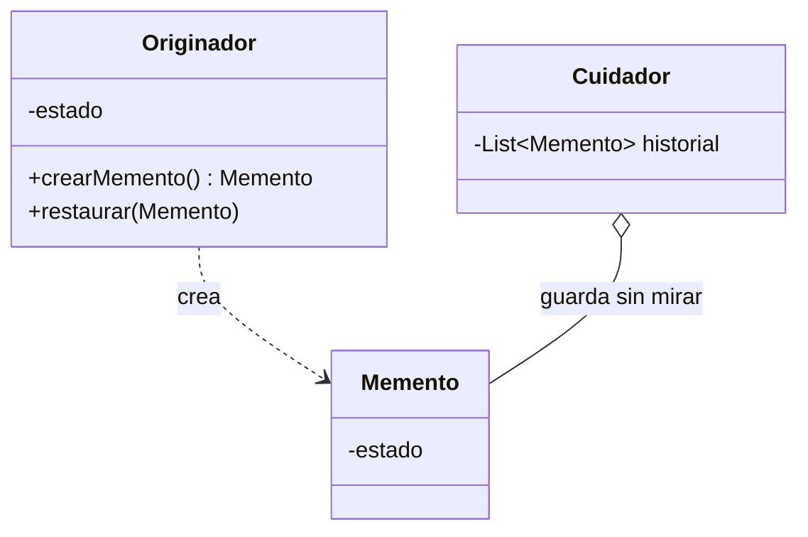

# Patrón Memento

## Definición

Captura y externaliza el estado interno de un objeto **sin violar su encapsulación**, de
manera que pueda restaurarse más tarde ([[fuente-s13-command-memento]], diapositiva 14).

## Problema que resuelve

Para poder volver atrás hay que guardar el estado anterior — pero exponerlo rompe la
encapsulación del objeto. El Memento lo guarda en una cápsula que sólo el objeto original
sabe interpretar.

## Estructura

## Ventajas y desventajas según el curso

A favor (diapositiva 16): mantiene la encapsulación, permite restaurar estados anteriores y
sirve para puntos de control y control de versiones.

En contra: **consume mucha memoria si se crean demasiados mementos**, gestionar su ciclo de
vida es complejo, y es ineficiente si el estado es grande y hay que guardar muchas
versiones.

## Aplicación en Podología Loayza

**Candidato, siempre acompañando a [[patron-command]]** *(propuesta del agente)*.

El `deshacer()` de un comando necesita saber **qué había antes**. Ahí entra el Memento:
antes de que la administradora corrija una marcación, se captura su estado; si la corrección
resulta equivocada, se restaura.

Es también la respuesta a un problema concreto de [[formato-cronograma-actual]]: hoy, cuando
alguien corrige una celda del Excel, **el valor anterior desaparece para siempre**. Con
Memento, cada versión de una marcación queda disponible, y se puede reconstruir cómo estaba
el cronograma en cualquier momento — que es exactamente lo que hace falta si una trabajadora
reclama por sus horas.

**La desventaja de memoria que advierte el curso sí importa aquí**, y hay que acotarla desde
el diseño:

- guardar el memento de la **marcación**, no del cronograma entero;
- **nunca** incluir la imagen en el memento: sólo su referencia. Un memento con la foto
  dentro multiplicaría el almacenamiento por cada corrección.
- conservar un número limitado de versiones, o purgarlas pasado el plazo legal de
  conservación.

## Patrones relacionados

[[patron-command]] (la pareja natural), [[patron-state]], [[patron-prototype]] (clona el
objeto vivo; el memento guarda una instantánea opaca).

## Errores comunes

Exponer el interior del memento y perder la encapsulación que justifica el patrón; guardar
demasiados o demasiado grandes.

## Fuentes

[[fuente-s13-command-memento]] (diapositivas 14–17)
