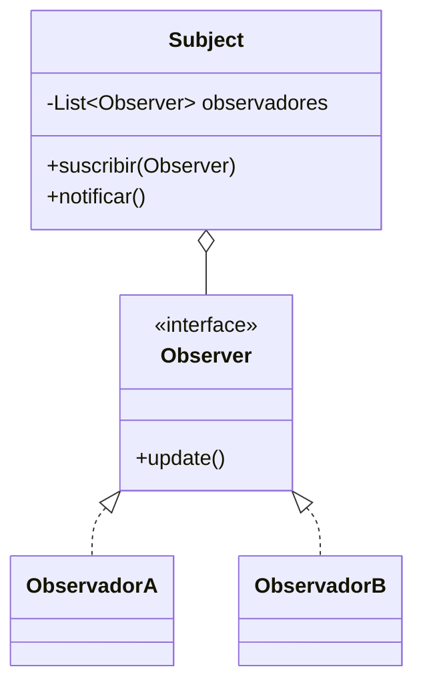

# Patrón Observer

## Definición

Define una dependencia uno-a-muchos: la clase `Subject` mantiene una lista de `Observer` y
**los notifica** cuando cambia su estado. La interfaz `Observer` declara el método
`update()` ([[fuente-s12-state-observer]], diapositiva 22).

## Problema que resuelve

Un cambio en un objeto debe reflejarse en otros, sin que el primero tenga que conocerlos.
Sin el patrón, quien produce el cambio termina llamando a mano a todo el que le interese, y
añadir un interesado obliga a modificarlo.

## Estructura

## Ejemplo del curso

> [!warning] Sin código en la fuente
> S12 describe los participantes (diapositiva 22) pero no trae Java.

## Aplicación en Podología Loayza

**Candidato fuerte, y con una particularidad: Spring ya lo trae de fábrica**
*(propuesta del agente)*.

Registrar una marcación desencadena varias cosas que **no son asunto del registro**:

- recalcular la jornada y el cronograma de la semana ([[formato-cronograma-actual]]);
- si quedó en revisión, avisar a la administradora;
- actualizar los conteos `MAÑANA` y `TARDE` — los que en el proceso manual llevaban 22
  semanas congelados;
- registrar la entrada de auditoría;
- alimentar métricas de acierto del reconocimiento facial.

Si el servicio de registro llamara a los cinco, cada nueva consecuencia lo obligaría a
cambiar. Publicando un evento `MarcacionRegistrada`, cada interesado se suscribe por su
cuenta y el registro no se entera de que existen.

**El matiz que conviene documentar en el entregable:** Spring implementa este patrón con
`ApplicationEventPublisher` y `@EventListener`. Usarlo **es** aplicar Observer, con el
`Subject` provisto por el marco. Escribir a mano la lista de observadores para «demostrar el
patrón» sería reimplementar algo que el contenedor ya hace mejor — el mismo razonamiento
que en [[patron-singleton]]. Lo valioso es reconocer el patrón donde ya está y justificarlo.

**Advertencia:** conviene que el recálculo del cronograma sea **asíncrono**, para que la
trabajadora reciba su confirmación en pantalla sin esperar a que se rehaga la semana entera.

## Patrones relacionados

[[patron-state]] (los cambios de estado son el disparador natural), [[patron-command]],
[[mvc]] (la vista observa al modelo).

## Errores comunes

Cadenas de notificación que se realimentan en bucle; observadores lentos que bloquean al
sujeto; olvidar dar de baja a un observador y filtrar memoria.

## Fuentes

[[fuente-s12-state-observer]] (diapositivas 22–23)
