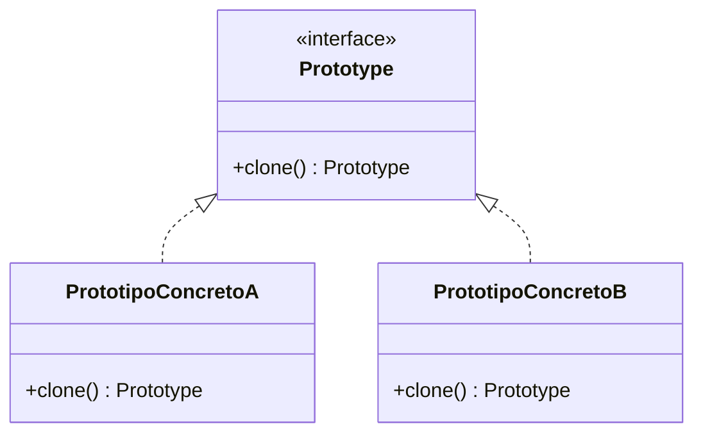

# Patrón Prototype

## Definición

Crea objetos nuevos **copiando una instancia existente** (el prototipo) en vez de
construirlos desde cero. Útil cuando la creación directa es costosa o compleja
([[fuente-s06-singleton-prototype]], diapositiva 17).

## Problema que resuelve

Construir un objeto requiere pasos caros —consultas, cálculos, configuración— que se
repiten idénticos. Clonar un ejemplar ya construido sale más barato.

## Estructura



En Java se apoya en `Cloneable` y `super.clone()`.

## Ejemplo del curso

```java
public abstract class Shape implements Cloneable {
    private String id;
    protected String type;
    abstract void draw();
    @Override
    public Object clone() {
        Object clone = null;
        try { clone = super.clone(); }
        catch (CloneNotSupportedException e) { e.printStackTrace(); }
        return clone;
    }
}
```

([[fuente-s06-singleton-prototype]], diapositivas 19–21)

## Aplicación en Podología Loayza

**Candidato, de alcance modesto** *(propuesta del agente)*.

Uso plausible: la **plantilla del cronograma semanal**. Cada semana se genera una rejilla
idéntica en estructura —las trabajadoras vigentes de la sede, siete días, la fila de
conteos— y sólo cambia el contenido. Clonar la plantilla de la semana anterior es más
barato y menos propenso a errores que rearmarla ([[formato-cronograma-actual]]).

Segundo uso posible: el **perfil de verificaciones antifraude por sede**. Todas las sedes
comparten la misma configuración base y una o dos difieren (una con GPS malo en galería, por
ejemplo). Clonar el perfil base y ajustar lo distinto ([[antifraude]]).

**Advertencia real:** `clone()` en Java hace copia **superficial**. Un cronograma que
contenga listas de marcaciones necesitaría copia profunda, y ahí el patrón deja de ser
gratis. Si termina siendo así, [[patron-builder]] es la alternativa más limpia.

## Patrones relacionados

[[patron-builder]] (construir paso a paso en vez de copiar), [[patron-factory]] (el curso
señala que las fábricas abstractas pueden implementarse con Prototype),
[[patron-singleton]] (el opuesto).

## Errores comunes

Confiar en la copia superficial cuando el objeto tiene referencias mutables; usarlo donde
un constructor normal bastaba.

## Fuentes

[[fuente-s06-singleton-prototype]] (diapositivas 17–22)
