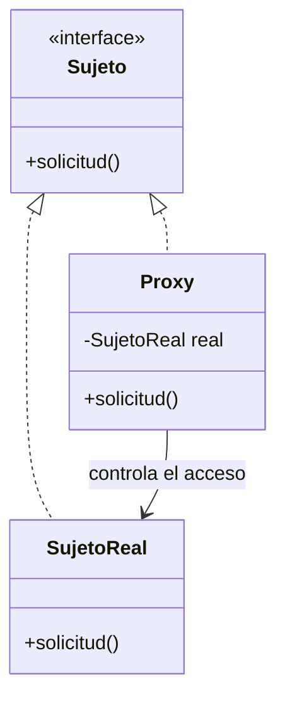

# Patrón Proxy

## Definición

Proporciona un **sustituto o marcador de posición** de otro objeto para **controlar el
acceso** a él ([[fuente-s11-proxy-bridge]], diapositiva 10).

## Problema que resuelve

Hace falta interponer algo entre el cliente y el objeto real: permisos, carga diferida,
acceso remoto o contabilidad de recursos.

## Los cuatro tipos, según el curso

| Tipo | Para qué | ¿Aplica aquí? |
|---|---|---|
| **Virtual Proxy** | Retrasa la creación y carga del objeto hasta que se necesite | **Sí** |
| **Protection Proxy** | Controla el acceso, con permisos distintos por usuario | **Sí** |
| **Remote Proxy** | Proxy local de un objeto en otro espacio de direcciones | No |
| **Smart Proxy** | Seguimiento de referencias, contabilidad de recursos | Quizá |

([[fuente-s11-proxy-bridge]], diapositiva 15)

## Estructura

Cómo aplicarlo (diapositiva 14): identificar el objeto que necesita control, crear un Proxy
**con la misma interfaz**, y delegar añadiendo la funcionalidad extra.

## Ejemplo del curso

> [!warning] Sin código en la fuente
> S11 no trae ejemplo en Java. Está en `S11-Ejemplo-MVC-Proxy-Bridge.docx`, sin ingerir.

## Aplicación en Podología Loayza

**Candidato fuerte, y el único patrón que responde directamente a una obligación legal**
*(propuesta del agente)*.

**1. Protection Proxy sobre las fotos y las plantillas biométricas.** El sistema almacena
rostros de personas reales: `CLAUDE.md` §8 exige acceso restringido. Un proxy delante del
almacén de evidencias comprueba el rol antes de entregar nada —una trabajadora sólo ve sus
propias marcaciones, la administradora ve las de su ámbito— y **deja registro de cada
acceso**. Como tiene la misma interfaz que el almacén real, ningún otro componente cambia.

Que esta comprobación viva en un proxy y no repartida por el código es lo que hace que la
garantía sea verificable: hay **un** sitio donde mirar.

**2. Virtual Proxy sobre las imágenes.** Una marcación se consulta muchas veces —para
conteos, para la rejilla, para reglas— y su foto casi nunca se necesita. Cargar el blob cada
vez sería un desperdicio. El proxy entrega los metadatos al instante y trae la imagen sólo
cuando alguien la pide de verdad, al abrir la cola de revisión.

**Distinción con [[patron-decorator]]**, que el curso subraya: aquí el interés del cliente
está en el **objeto agregado** (quiere la evidencia, y el proxy media el acceso). En el
Decorator, el interés está en lo que se añade.

## Patrones relacionados

[[patron-decorator]] (misma estructura, otra intención), [[patron-adapter]] (traduce en vez
de controlar), [[patron-facade]].

## Errores comunes

Que el proxy y el objeto real dejen de compartir interfaz; meter lógica de negocio en él;
usar un Virtual Proxy donde la carga diferida no ahorra nada.

## Fuentes

[[fuente-s11-proxy-bridge]] (diapositivas 10–17)
