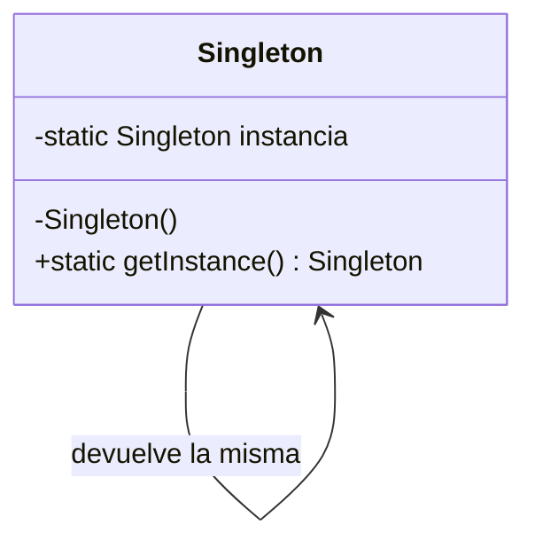

# Patrón Singleton

## Definición

Garantiza que una clase tenga **una única instancia** y proporciona un **punto de acceso
global** a ella ([[fuente-s06-singleton-prototype]], diapositiva 12). Dos variedades:
**instanciación temprana** (se construye al cargar la clase) e **instanciación perezosa**
(sólo cuando se necesita).

## Problema que resuelve

Un objeto costoso o que coordina algo global se instancia muchas veces sin querer. El caso
del curso: `DBConnection` instanciada en cada lugar del código abre una conexión distinta a
la base de datos cada vez (diapositiva 11).

## Estructura



Participantes: una sola clase, con **constructor privado**, campo estático privado y método
estático público de acceso.

## Ejemplo del curso

```java
public class Singleton {
    private static Singleton uniqueInstance;
    private Singleton() { }                     // impide instanciar desde fuera
    public static Singleton getInstance() {
        if (uniqueInstance == null) {           // instanciación perezosa
            uniqueInstance = new Singleton();
        }
        return uniqueInstance;
    }
}
```

([[fuente-s06-singleton-prototype]], diapositiva 15)

## Aplicación en Podología Loayza

> [!warning] Contradicción abierta (2026-09-05)
> **La rúbrica de PC-3 exige Singleton y Prototype en la capa modelo**
> ([[fuente-pc2-pc3-entregables]]), y el uso de patrones es el criterio de mayor peso
> (6 de 20 puntos).
>
> El análisis de abajo sigue siendo técnicamente correcto, pero **ya no puede aplicarse sin
> más**: el descarte cuesta puntos. La salida propuesta es aplicarlo donde sí aporte —una
> configuración de umbrales antifraude cargada una sola vez— y explicar en el informe la
> diferencia con el alcance *singleton* que da Spring. Decisión pendiente del usuario.

**Análisis original — no se implementa a mano.** Es la conclusión menos obvia y la más importante de este
patrón *(propuesta del agente)*.

El problema que el Singleton resuelve —una única instancia compartida— **ya lo resuelve el
contenedor de Spring**: todo bean tiene alcance *singleton* por defecto. Escribir a mano un
`getInstance()` dentro de una aplicación Spring reproduce el patrón *encima* de un
mecanismo que ya lo garantiza, y arrastra las tres desventajas que el propio curso enumera
(diapositiva 14): problemas con múltiples hilos, violación de la responsabilidad única y
pruebas unitarias muy difíciles.

Esa última es decisiva aquí: el sistema tiene que poder probarse con marcaciones falsas,
relojes falsos y reconocedores faciales falsos. El estado global lo impide.

**Dónde sí aparece, sin escribirlo:** la configuración de umbrales antifraude, el reloj del
servidor y el motor de reconocimiento facial son instancias únicas — pero como beans
inyectados, sustituibles en pruebas.

> [!tip] Para el entregable del curso
> Conviene documentar esta decisión, no esconderla: reconocer que el marco ya provee el
> patrón y explicar por qué duplicarlo sería un [[antipatrones|antipatrón]] demuestra más
> criterio que forzar un `getInstance()`.

## Patrones relacionados

[[patron-factory]] (una fábrica suele ser única), [[patron-prototype]] (el opuesto: muchas
copias en vez de una sola).

## Errores comunes

Usarlo como excusa para tener estado global mutable; olvidar la seguridad entre hilos en la
versión perezosa; convertirlo en un contenedor de servicios que lo sabe todo.

## Fuentes

[[fuente-s06-singleton-prototype]] (diapositivas 11–16)
