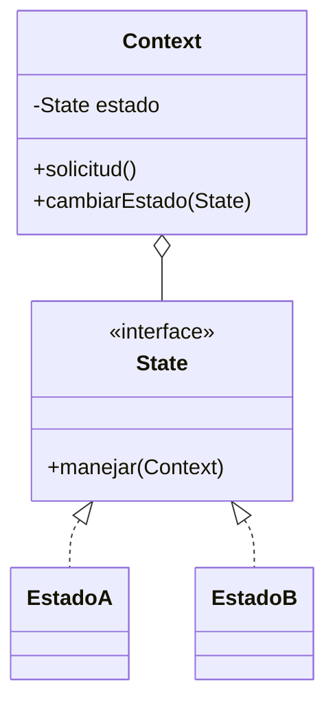

# Patrón State

## Definición

Permite que un objeto **cambie su comportamiento según su estado interno**. Una interfaz
`State` declara los métodos que implementan los estados concretos; el objeto **Context**
guarda una referencia a un `State` y **delega** en él
([[fuente-s12-state-observer]], diapositiva 18).

## Problema que resuelve

Un objeto que se comporta distinto en cada fase de su vida. Sin el patrón, aparece un
`switch` sobre un campo `estado` repetido en cada método, y añadir una fase obliga a tocar
todos.

## Estructura



## Ejemplo del curso

> [!warning] Sin código en la fuente
> S12 sólo trae la descripción de los participantes y una tabla de ventajas y desventajas
> (diapositivas 18–20). El código habría que sacarlo de `S12-GUIA-TALLER_DPA.docx`, sin
> ingerir.

## Aplicación en Podología Loayza

**Candidato fuerte** *(propuesta del agente)*.

Una `Marcacion` recorre un ciclo de vida con reglas distintas en cada fase:

```
RECIBIDA → VALIDADA → IDENTIFICADA → REGISTRADA
    │           │            │
    └───────────┴────────────┴──→ EN_REVISION → APROBADA
                                        │
                                        └─────→ RECHAZADA
```

Lo que cambia según el estado no es cosmético:

- una marcación `EN_REVISION` **no cuenta** para el cronograma; una `REGISTRADA` sí;
- sólo desde `EN_REVISION` la administradora puede corregir la hora o reasignar la
  trabajadora;
- una `APROBADA` manualmente conserva la marca de que fue intervenida, y eso debe salir en
  la auditoría;
- una `RECHAZADA` no se borra —la evidencia se conserva ([[antifraude]], principio 4)— pero
  deja de contar.

Modelar esto como estados con su propio comportamiento evita el `switch` repetido y, sobre
todo, hace **imposibles las transiciones ilegales**: que algo pase de `RECHAZADA` a
`REGISTRADA` sin pasar por revisión no debería poder ni escribirse.

El curso advierte que el patrón *puede ser excesivo si sólo hay pocos estados*
(diapositiva 20). Aquí hay seis, con reglas de transición reales: está justificado.

Segundo candidato, más pequeño: la **celda del cronograma**, que es horario, estado
(`DESCANSO`, `VACACIONES`, `INASISTENCIA`…) o pendiente de resolver
([[formato-cronograma-actual]]).

## Patrones relacionados

[[patron-observer]] (los cambios de estado son justo lo que se notifica),
[[patron-command]] (las transiciones se pueden encapsular como comandos),
[[patron-memento]].

## Errores comunes

Que los estados conozcan demasiado del contexto; repartir las reglas de transición entre
estados y contexto hasta que nadie sepa dónde mirar.

## Fuentes

[[fuente-s12-state-observer]] (diapositivas 18–21)
